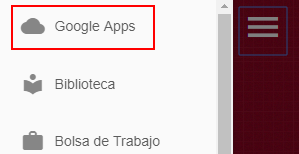
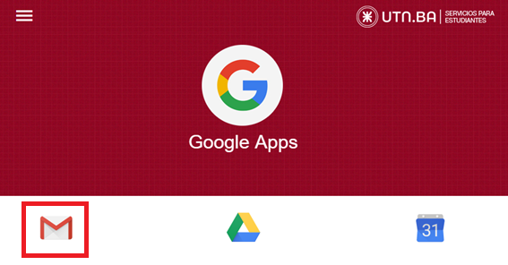
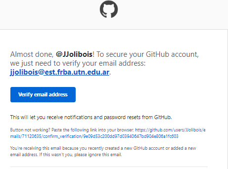
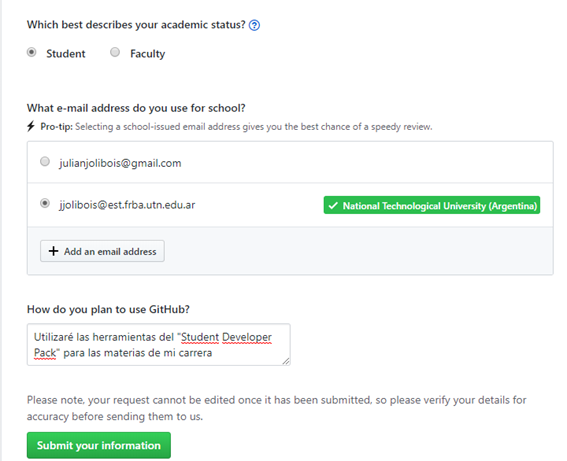
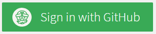
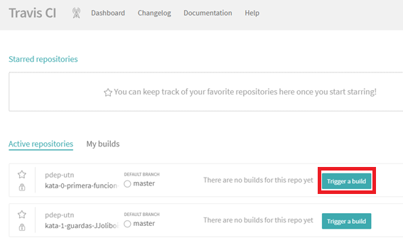
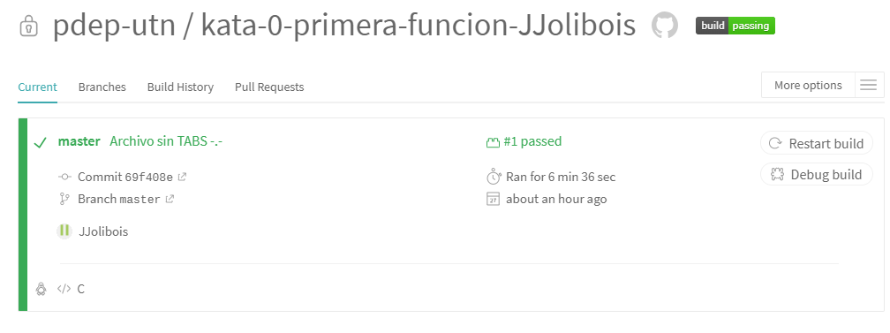
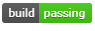
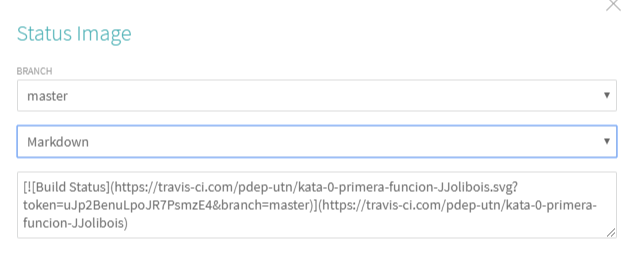

# Ingresando en Travis
## Upgrade a la cuenta de GitHub
Seguramente tu cuenta de GitHub es free, sin embargo por ser de la UTN podemos acceder a la versión PRO y un paquete de aplicaciones con los que está asociado Github.
Para acceder a ellos, hay que seguir los siguientes pasos:

### 1) Agregar mail de la UTN a Github
Tenes que entrar a Settings y luego a Emails. Completas con tu usuario de la UTN y le das a Add.

Si no conoces tu mail de la utn es <usuarioSingUp>@est.frba.utn.edu.ar

### 2) Validar mail
Github nos va a pedir que verifiquemos que el email está ok.
¿Pero cómo entro a la casilla de este email si hasta hace dos minutos no sabía de su existencia?
Vas a tener que [ingresar al Portal de Autogestión de Alumnos](https://est.frba.utn.edu.ar/), loguearte con tu usuario SignUp de la UTN
Luego abrir Google Apps

Y luego abrir Gmail

Ahí vas a tener un mail de Github esperandote. Le das a verificar y listo.

### 3) Solicitando los beneficios a Github
Tenemos que [entrar acá](https://education.github.com/pack) y presionar Get Your Pack:

Nos va a solicitar que completemos este formulario:

Y listo! Tenemos nuestra cuenta Pro

Parrafo aparte, te recomendamos [entrar a ver los beneficios de Github](https://education.github.com/pack/offers) donde vas a ver a todo lo que tenes acceso.

## Ahora si, vamos a Travis
### Primero creamos la cuenta
Tenemos que [entrar a TravisCI](https://education.travis-ci.com/) y nos logueamos con la cuenta de GitHub

Travis te va a pedir que le autorices instalarse en Github y listo.

### Y ahora a trabajar!
Vamos al [Dashboard](https://travis-ci.com/dashboard) y nos vamos a encontrar con todas las Katas que hicimos y vamos a poder buildearlos.

### ¿Salió todo bien?
Entremos al repo una vez finalizado el build y veamoslo

### Y por ultimo, agregar el badge
Dale clic sobre

Luego selecciona la opción Markdown y eso es lo que tenes que pegar a tu README

